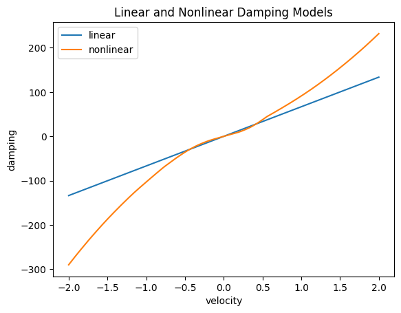

# Learning a Nonlinear Damping Model with a Neural ODE

This project trains a **neural ordinary differential equation (neural ODE)** on
real experimental data to learn the *nonlinear* damping law of a mass–spring
system, and compares the learned dynamics against the classical linear-damping
model taught in an introductory differential equations course.

It is the companion code for the paper:

> N. Albin, A. G. Bennett, and A. Chand.
> **"Machine Learning for Modeling in an Elementary Differential Equations Class."**
> *CODEE Journal*, vol. 20, no. 2, 2026.
> [scholarship.claremont.edu/codee/vol20/iss2/1](https://scholarship.claremont.edu/codee/vol20/iss2/1/)
> · DOI: [10.5642/codee.QKJJ1808](https://doi.org/10.5642/codee.QKJJ1808)

> [!WARNING]
> To reset this project for students, you'll need to find the seed choices in the section **Fitting the model** and swap the commented-out line.

## What it does

A standard mass–spring model assumes *linear* damping, `m x'' + c x' + k x = 0`.
Real systems often damp nonlinearly. Instead of guessing a functional form, this
project represents the damping term with a small neural network and learns it
directly from measured trajectory data by:

1. casting the dynamics as a first-order ODE system,
2. parameterizing the unknown (nonlinear) damping with a neural network,
3. integrating the system with a differentiable ODE solver, and
4. fitting the network by gradient descent so the simulated trajectory matches
   the experimental data.

The notebook also discusses *when machine learning helps and when it does not* —
how much data is needed, and how the learned model compares to the linear
baseline.

## Contents

| File | Description |
|------|-------------|
| `Learning_a_Nonlinear_Damping_Model.ipynb` | Main notebook: data loading, model definition, training, and comparison plots. Runs as-is on Google Colab — no local setup required. |
| `data.csv` | Experimental trajectory data for the mass–spring system. |
| `model.pt` | Trained PyTorch model weights. |

## Running it

**Easiest — Google Colab:** open the notebook in Colab and run all cells; no
installation needed.

**Locally:**

```bash
pip install -r requirements.txt
jupyter lab Learning_a_Nonlinear_Damping_Model.ipynb
```




## Built with

Python · PyTorch · neural ODEs · Jupyter

## License

MIT — see [`LICENSE`](LICENSE).
